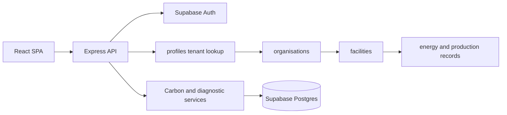

# Balancing Carbon Architecture

## Scope

This document describes the compatibility-first Phase 1 architecture. It does not add billing, subscriptions, feature gates, an admin panel, new dashboards, or AI API calls. Existing HTTP paths, request bodies, response bodies, calculations, authentication, and UI flows remain the contract.

## Runtime Flow



Every authenticated API handler resolves `profiles.organisation_id` from the authenticated Supabase user and filters tenant-owned records by that identifier. Facilities are the current operational boundary. Departments are intentionally deferred, but all current resource schemas can be extended with a nullable `department_id` without changing tenant ownership.

## Backend Boundaries

| Boundary | Responsibility |
| --- | --- |
| `server.ts` | HTTP composition, static/Vite hosting, remaining Phase 2 endpoints, process startup. |
| `server/routes/*` | Route-level request parsing and stable API compatibility. |
| `server/auth.ts` | Bearer-token validation and tenant profile resolution. |
| `server/carbonAccounting.ts` | Emission-factor lookup, activity calculations, monthly aggregation. |
| `server/phase2CarbonIntelligence.ts` | Diagnostics, scenarios, data completeness, opportunity calculations. |
| `server/facilityAggregates.ts` | Refreshes stored facility summary fields after energy writes. |
| `server/rowMappers.ts` | Maps database snake_case rows to existing frontend camelCase contracts. |
| `server/requestUtils.ts` | Shared primitive parsing/validation helpers. |
| `server/supabaseClients.ts` | Supabase clients configured from environment only. |

The legacy `server/db.ts` local JSON store is not used by the current Supabase runtime. It remains present only to avoid an unreviewed deletion of historical development support.

## API Composition

```mermaid
flowchart TD
  Server[server.ts] --> AuthRoutes[/api/auth]
  Server --> OrgRoutes[/api/organisation]
  Server --> FacilityRoutes[/api/facilities]
  Server --> EnergyRoutes[/api/energy]
  Server --> FactorRoutes[/api/emission-factors]
  Server --> ProductionRoutes[/api/production]
  Server --> ComplianceRoutes[/api/esg and /api/oem-surveys]
  Server --> ReportingRoutes[/api/documents and /api/reports]
  Server --> Intelligence[Phase 2 diagnostics, opportunities, scenarios and projects]
```

## Data Model And Migrations

Apply migrations to a fresh Supabase project in this order:

1. `server/migrations/000_base_schema.sql`
2. `server/migrations/001_activity_carbon_engine.sql`
3. `server/migrations/002_phase2_carbon_intelligence.sql`
4. `server/migrations/003_demo_seed.sql` only when demo data is desired
5. `server/migrations/004_enterprise_saas_foundation.sql`
6. `server/migrations/005_authentication_authorization.sql`
7. `server/migrations/006_legacy_timestamp_repair.sql` only for databases created before the base schema migration
8. `server/migrations/007_subscription_pricing.sql`

Core ownership is `organisation -> facilities -> operational records`. Cross-cutting tenant-owned entities include ESG questions, OEM surveys, documents, reports, audit logs, diagnostics, opportunities, scenarios, and projects. The base schema includes foreign keys, check constraints, tenant indexes, timestamps, update triggers, and foundational RLS policies.

## Frontend Flow

`src/App.tsx` is the current integration root: it owns session state, initial parallel data hydration, and page-level mutation callbacks. Components in `src/components` are feature surfaces; `src/data` contains public service catalog data. The UI intentionally remains unchanged during Phase 1. A later compatibility-safe frontend pass can extract API and feature hooks from `App.tsx` without changing views or routing.

## Deployment And Configuration

Local development uses `npm run dev`, which starts Express and Vite middleware together. Production builds the SPA with Vite and bundles Express with esbuild. `api/index.ts` exports the Express application for Vercel.

Required runtime configuration is kept in `.env` and documented in `.env.example`:

- `SUPABASE_URL`
- `SUPABASE_ANON_KEY`
- `SUPABASE_SERVICE_ROLE_KEY`
- `PORT` (optional)

`004_enterprise_saas_foundation.sql` adds inactive foundation tables for membership, settings, roles, permissions, plans, subscriptions, feature flags, usage, licenses, and system settings. It does not create seed data or enable entitlement checks.

AI configuration is intentionally not connected. The existing AI-facing interface is a future integration boundary only.

## Authentication And Authorization

Supabase Auth remains the identity provider. The API validates the bearer token, resolves the user profile and organisation, then obtains roles and permissions from `user_roles`, `roles`, `role_permissions`, and `permissions`. `profiles.role` remains in the login response for legacy UI compatibility.

The Phase 2 migration seeds the initial role and permission catalog as database records, backfills existing profiles as organisation administrators, and adds auth-event and invitation architecture. Session refresh is exposed through `/api/auth/refresh`; the frontend API client refreshes near-expiry sessions before authenticated mutation calls.

## Next Safe Refactors

1. Move the remaining Phase 2 intelligence endpoints into an `intelligenceRoutes` module while retaining current paths.
2. Extract repository functions from route modules after endpoint-level regression tests exist.
3. Split `src/App.tsx` into feature hooks and an API client, with the component props and visual output unchanged.
4. Add request logging, structured application errors, tenant-resolution middleware, and audit event writing behind non-enforcing middleware.
5. Add database migrations for future role, permission, plan, subscription, feature-flag, usage, license, and system-setting entities only after confirming their relationship to the already-deployed schema.
