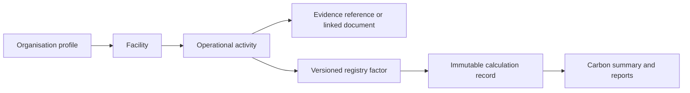

# Carbon Accounting Runtime

## Workflow

The live energy ledger remains compatible with the original `energy_records` dashboard model. Each new or updated entry also creates an `activity_records` row and a `calculation_records` lineage row. Updates supersede prior calculations; deletes soft-delete the activity and invalidate its current calculation.

## Factor Policy

Factors are read from `emission_factor_registry` at calculation time. The application code no longer selects numeric factors for live ledger calculations. `014_phase5_carbon_accounting_runtime.sql` seeds an initial India-focused registry to preserve existing behaviour, but these values are explicitly initial deployment values and must be reviewed and approved for an organisation before audit use.

Useful primary references for the registry review are the Central Electricity Authority's Indian power-sector CO2 baseline database and the IPCC stationary-combustion guidance.

## APIs

| Method | Path | Purpose |
| --- | --- | --- |
| GET | `/api/emission-factors` | Active versioned factor registry |
| GET | `/api/carbon-activities` | Activity ledger with factor, evidence, and calculation relations |
| GET | `/api/carbon-activities/:id/lineage` | Auditor-facing activity lineage |
| PATCH | `/api/carbon-activities/:id/status` | Data-quality review status |
| POST | `/api/carbon-activities/:id/recalculate` | Create a superseding current calculation |
| GET | `/api/carbon-data-quality` | Verification, evidence, and review indicators |
| GET | `/api/carbon-summary` | Current calculation aggregates for dashboards and reports |

## Migration Order

For Phase 5 runtime functionality, run:

1. `010_carbon_accounting_foundation.sql`
2. `014_phase5_carbon_accounting_runtime.sql`

Phase 4 must also be present because all writes continue to pass the existing license and permission controls.
