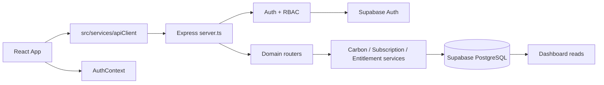

# Codebase Index

Last reviewed: 2026-07-13 after formal Phase 14 Marketplace and Integrations. This index covers tracked application files and intentionally excludes `.env`, `node_modules/`, `dist/`, log files, and Git internals. Update it after every major phase.

## Folder Tree

```text
Balancing_Carbon/
  api/index.ts                     Vercel serverless entry
  docs/                            Technical documentation
  public/                          Browser icons and brand image
  server/
    config/                        Runtime settings
    middleware/                    Express cross-cutting controls
    migrations/                    Ordered Supabase schema migrations
    routes/                        Express REST routers
    services/                      Reserved foundation service stubs
    *.ts                           Accounting, auth, mapping, Supabase helpers
  src/
    assets/images/                 Source logo asset
    components/                    Public-site and dashboard UI modules
    contexts/                      Client auth context
    data/                          Public service-catalog content
    hooks/                         Subscription and entitlement data hooks
    services/                      Browser API/session client
  assets/.aistudio/.gitignore      AI Studio artifact metadata
  index.html                       Vite document shell
  package.json                     Scripts and dependencies
  server.ts                        Express composition root
  vite.config.ts                   Vite/Tailwind configuration
```

## System Dependency Map



```mermaid
flowchart LR
  Ledger[EnergyTracking] --> EnergyAPI[/api/energy]
  EnergyAPI --> Registry[emission_factor_registry]
  Registry --> Engine[carbonAccounting.ts]
  Engine --> Lineage[activity_records + calculation_records]
  Lineage --> Summary[/api/carbon-summary]
  Summary --> Dashboard[DashboardOverview]
```

```mermaid
flowchart LR
  Pricing[PricingPage] --> SubscriptionHook[useSubscription]
  SubscriptionHook --> SubscriptionAPI[/api/subscription]
  SubscriptionAPI --> SubscriptionService
  SubscriptionService --> Plans[(plans + subscriptions)]
  Plans --> Entitlements[(plan_entitlements + limits)]
  Entitlements --> Gate[EntitlementGate + API middleware]
```

## API Endpoint Index

| Router | Endpoints | Primary tables/services |
| --- | --- | --- |
| Health | `GET /api/health` | Runtime status only |
| Auth | `POST /api/auth/signup`, `/login`, `/refresh`, `/logout`, `/logout-all`, `/password-reset`, `/password-update`; `GET /me`, `/permissions`, `/roles`, `/memberships`, `/role-catalog`, `/audit-events`; `PATCH /profile`, `/memberships/:id`; `DELETE /memberships/:id`; `POST /invitations` | Supabase Auth, profiles, members, roles, subscriptions, licenses |
| Organisation | `GET`, `POST /api/organisation` | organisations |
| Facilities | `GET`, `POST /api/facilities`; `PATCH`, `DELETE /api/facilities/:id`; `POST /api/facilities/:id/archive` | facilities, usage limits |
| Energy | `GET`, `POST /api/energy`; `PATCH`, `DELETE /api/energy/:id` | energy_records, registry, activity/calculation lineage |
| Factors | `GET /api/emission-factors` | emission_factor_registry |
| Production | `GET`, `POST /api/production` | production_records, activity_records |
| Carbon accounting | `GET /api/carbon-activities`, `/api/carbon-activities/:id/lineage`, `/api/carbon-data-quality`, `/api/carbon-summary`; `PATCH /api/carbon-activities/:id/status`; `POST /api/carbon-activities/:id/recalculate` | activity_records, evidence links, calculation_records |
| Intelligence | Diagnostic questions/responses, diagnostics, opportunities, scenarios, projects, milestones, measurements under `/api/*` | Phase 2 intelligence tables and deterministic engine |
| Compliance | ESG question update and OEM survey create/approve under `/api/*` | esg_questions, oem_questionnaires |
| Reporting compatibility | Documents list/create/delete and reports list/create under `/api/*` | documents, reports, usage |
| Reporting platform | Frameworks, templates, versioned reports, approvals, exports, and schedules under `/api/reporting/*` | Phase 6 reporting tables, calculation lineage, entitlements |
| Subscription | `GET /api/plans`, `/subscription`, `/subscription/usage`, `/subscription/features`; `POST /subscription/upgrade`, `/cancel`, `/renew` | plans, subscriptions, events/history |
| Entitlements | `GET /api/entitlements`, `/organization/entitlements`, `/organization/limits`, `/organization/usage`, `/license`; `POST /license/:action` | entitlement and license tables |
| Localization and units | `GET|PUT /api/localization`, `PUT /api/localization/me`; registry-backed unit discovery, conversion, display, and administration under `/api/units/*` | localization, unit registry, conversion history |
| Enterprise reference data | Generic categories, values, search, hierarchy and configuration under `/api/reference/*` | reference data registries |
| Workflow and collaboration | `GET /api/collaboration/workspace`; create/update tasks, comments, reviews, evidence requests, document approvals and notifications under `/api/collaboration/*`; `POST /api/collaboration/escalations/run` | Phase 12 collaboration tables, workflow rules, notification and email outbox helpers |
| Public ESG Portal | Anonymous `GET /api/public/portals/:slug`; authenticated configuration, assets, publish and withdraw under `/api/portal/admin/*` | Public portal snapshot, publication history, approved tenant aggregates |
| Marketplace and developer API | `GET /api/marketplace/workspace`; install/uninstall and credential/webhook administration under `/api/marketplace/*`; OpenAPI and scoped developer endpoints under `/api/developer/*` | Marketplace catalog/installations, hashed API credentials, webhook definitions, usage audit |

## Database Table Index

| Domain | Tables | Status |
| --- | --- | --- |
| Tenant core | `organisations`, `profiles`, `facilities`, `organization_members`, `organization_settings` | Active |
| Carbon ledger | `energy_records`, `production_records`, `emission_factors`, `emission_factor_registry`, `activity_records`, `activity_evidence_links`, `calculation_records` | Active; `emission_factors` is legacy-compatible |
| Evidence/reporting | `documents`, `reports`, `audit_logs`, `ai_conversations` | Documents/reports active; AI conversations reserved |
| ESG/intelligence | `esg_questions`, `oem_questionnaires`, `diagnostic_question_responses`, `diagnostic_findings`, `reduction_opportunities`, `reduction_scenarios`, `decarbonization_projects`, `project_milestones`, `project_measurements` | Active except findings are not persisted by current router |
| RBAC | `roles`, `permissions`, `role_permissions`, `user_roles`, `auth_events`, `organization_invitations` | Active |
| Subscription | `plans`, `subscriptions`, `plan_features`, `plan_limits`, `subscription_history`, `subscription_events`, `future_invoices`, `future_discounts`, `future_coupons` | Active; `future_*` reserved |
| Entitlements | `entitlement_categories`, `entitlements`, `plan_entitlements`, `organization_entitlements`, `organization_limits`, `organization_usage`, `usage_events`, `license_assignments`, `license_events` | Active |
| Localization and measurement | `organization_localization`, `organization_units`, `user_localization`, `unit_categories`, `unit_registry`, conversions, aliases, display/validation rules, `conversion_history` | Active after migration 016 |
| Enterprise reference data | categories, values, translations, relationships, versions, audit and import/export job tables | Active after migration 016 |
| Reporting and compliance | `compliance_frameworks`, `report_templates`, `report_versions`, `report_sections`, `report_evidence_links`, `report_approvals`, `report_exports`, `report_schedules` | Active after migrations 011 and 015 |
| Workflow and collaboration | `collaboration_tasks`, `collaboration_comments`, `review_cycles`, `evidence_requests`, `collaboration_notifications`, `collaboration_activity_feed`, `document_approvals`, `collaboration_email_outbox` | Active after migration 028 |
| Public ESG Portal | `public_esg_portals`, `public_portal_assets`, `public_portal_publications` | Active after migration 029 |
| Marketplace and integrations | `marketplace_items`, `marketplace_installations`, `developer_api_credentials`, `webhook_subscriptions`, `webhook_deliveries`, `developer_api_usage` | Active after migration 030 |
| Legacy enterprise foundation | `feature_flags`, `organization_feature_flags`, `usage_metrics`, `licenses`, `system_settings` | Present but unused by runtime |

## React Component Index

| Component | Role | Status |
| --- | --- | --- |
| `App.tsx` | Public routing, dashboard shell, state and API orchestration | Active, high complexity; split by dashboard domain |
| `DashboardOverview.tsx` | Operational KPIs, trend, facility and data-quality view | Active |
| `DashboardSidebar.tsx` | Dashboard navigation | Active; contains static tenant/menu labels |
| `FacilityManagement.tsx` | Facility CRUD UI | Active |
| `EnergyTracking.tsx` | Energy/fuel and production ledger UI | Active |
| `CarbonEngineUI.tsx` | Scope-specific ledger explorer | Active |
| `CarbonIntelligenceHub.tsx` | Diagnostics, scenarios, projects | Active, Professional-gated |
| `ESGAssessmentModule.tsx` | ESG answer/evidence workflow | Active, Professional-gated |
| `OEMQuestionnaireModule.tsx` | OEM workflow UI | Active, Professional-gated |
| `DocumentCentre.tsx` | Document metadata vault | Active |
| `SubscriptionSettings.tsx` | Plan, usage, license settings | Active |
| `EntitlementGate.tsx` | Locked-state wrapper | Active |
| `LocalizationSettings.tsx` | Organization locale, currency, standards, and display-unit preferences | Active |
| `ReportingWorkspace.tsx` | Responsive ESG report library, page canvas, block inspector, branding, evidence, AI drafting, workflow, and exports | Active |
| `PricingPage.tsx` | Public plan catalog | Active |
| `PublicCarbonCalculator.tsx` | Public, non-persistent calculation sandbox | Active; clearly keep separate from audit ledger |
| `AIAssistantModule.tsx` | Future AI placeholder | Active placeholder; no API connection |
| `AssessmentForm.tsx` | Public assessment lead flow | Active |
| `ServiceFirstFlow.tsx`, `SectorServicesFlow.tsx` | Public service catalog flows | Active, high complexity |
| `CalculatedDashboard.tsx` | Service-flow example/dashboard | Active only through `SectorServicesFlow` |
| `AsymmetricInfinityLogo.tsx` | Shared brand mark | Active |
| `CollaborationCenter.tsx` | Tasks, comments, mentions, reviews, evidence, approvals, notifications, escalations and activity trail | Active, Professional-gated |
| `PublicPortalAdmin.tsx`, `PublicESGPortal.tsx` | Controlled portal publication and anonymous responsive disclosure experience | Active, Enterprise-gated administration |
| `MarketplaceHub.tsx` | Catalog, installations, scoped credentials, webhooks, usage and API contract workspace | Active, Professional catalog and Enterprise developer features |

## Services, Hooks, Middleware, Context

| Type | File | Purpose | Status |
| --- | --- | --- | --- |
| Client service | `src/services/apiClient.ts` | Session persistence, authenticated fetch, token refresh | Active |
| Context | `src/contexts/AuthContext.tsx` | Client auth session and RBAC helpers | Active; App still duplicates some auth state |
| Hook | `src/hooks/useSubscription.ts` | Subscription and usage retrieval | Active |
| Hook | `src/hooks/useEntitlements.ts` | Entitlements, limits, license retrieval | Active |
| Service | `server/carbonLedgerService.ts` | Registry lookup and immutable activity/calculation lineage | Active |
| Service | `server/subscriptionService.ts` | Plan catalog, subscription change, usage | Active |
| Service | `server/entitlementService.ts` | Effective plan/override limits, usage, license sync | Active |
| Service | `server/reportingEngine.ts` | Report snapshot, validation, and dependency-free exports | Active |
| Service | `server/measurementService.ts` | Registry-backed unit resolution, graph conversion, smart display, audit history | Active |
| Service | `server/localizationService.ts` | Organization/user localization settings and catalogs | Active |
| Domain rules | `server/workflowRules.ts` | Task transitions, overdue evaluation and tenant-member mention validation | Active |
| Domain rules | `server/publicPortalEngine.ts` | Slug/section normalization, publication readiness and privacy-safe supplier aggregation | Active |
| Security rules | `server/marketplaceSecurity.ts` | One-time secrets, hashing, scope/event allow-lists, HTTPS validation and non-executable manifests | Active |
| Service | `server/services/foundationServices.ts` | Empty Phase 1 interfaces | Unused; refactor into real services or remove |
| Middleware | `server/auth.ts` | Bearer auth and RBAC gates | Active |
| Middleware | `server/middleware/entitlements.ts` | License, entitlement, and limit enforcement | Active |
| Middleware | `errorHandler.ts`, `requestLogger.ts` | Errors and request IDs/logging | Active |
| Middleware | `tenantResolution.ts`, `validateRequest.ts` | Optional helpers | Unused; adopt or remove |

## File Catalog

Columns: **Depends on** / **Used by** / **Status** / **Complexity** / **Recommendation**.

### Root, deployment, and assets

| File | Purpose | Depends on | Used by | Status | Complexity | Recommendation |
| --- | --- | --- | --- | --- | --- | --- |
| `.env.example` | Safe environment-variable template | Runtime config | Developers | Active | Low | Keep |
| `.gitattributes` | Text normalization | Git | Git | Active | Low | Keep |
| `.gitignore` | Ignore secrets/build artifacts | Git | Git | Active | Low | Keep |
| `api/index.ts` | Vercel function entry | `server.ts` | Vercel | Active | Low | Keep |
| `index.html` | Vite HTML shell | Vite assets | Browser | Active | Low | Keep |
| `metadata.json` | Legacy AI Studio metadata | None | Tooling only | Deprecated | Low | Remove Gemini capability declaration or update |
| `package.json` | Scripts/dependency manifest | npm | Tooling | Active | Low | Keep; remove unused Google AI dependency when confirmed |
| `package-lock.json` | Locked dependency graph | npm | npm | Active | Low | Keep |
| `README.md` | Product overview | Project | Developers | Active but stale | Medium | Update after audit |
| `server.ts` | Express composition root | Routers, middleware, Vite | npm/Vercel | Active | Medium | Keep |
| `tsconfig.json` | TypeScript settings | TypeScript | Tooling | Active | Low | Keep |
| `vercel.json` | SPA/API rewrites | Vercel | Deployment | Active | Low | Keep |
| `vite.config.ts` | React/Tailwind bundler config | Vite | Build | Active | Low | Keep |
| `assets/.aistudio/.gitignore` | AI Studio artifact exclusion | Tooling | Tooling | Unused | Low | Remove if AI Studio is no longer used |
| `public/Balancing.png` | Brand asset | Browser | Public UI | Active | Low | Keep |
| `public/android-chrome-192x192.png`, `android-chrome-512x512.png`, `apple-touch-icon.png` | Device icons | Browser manifest | Browser | Active | Low | Keep |
| `public/favicon.ico`, `favicon-16x16.png`, `favicon-32x32.png` | Favicons | HTML/manifest | Browser | Active | Low | Keep |
| `public/site.webmanifest` | PWA metadata | Browser | Browser | Active | Low | Keep |
| `src/assets/images/balancing_logo_1783605819990.jpg` | Source logo asset | UI imports | Brand UI | Active | Low | Keep |

### Frontend application

| File | Purpose | Depends on | Used by | Status | Complexity | Recommendation |
| --- | --- | --- | --- | --- | --- | --- |
| `src/main.tsx` | React bootstrap and providers | `App`, `AuthProvider`, CSS | Vite | Active | Low | Keep |
| `src/App.tsx` | Main routing/state/API orchestration | Components, API client, types | `main.tsx` | Active | High | Refactor into route/domain containers |
| `src/index.css` | Tailwind/theme/global styles | Tailwind | All UI | Active | High | Keep; split tokens from page styles |
| `src/types.ts` | Shared browser-domain types | Components | Frontend | Active | Medium | Keep |
| `src/services/apiClient.ts` | Fetch/session implementation | Browser storage | App/hooks/components | Active | Medium | Keep |
| `src/contexts/AuthContext.tsx` | Auth context/hooks | API client | `main.tsx`, future consumers | Active | Medium | Consolidate App auth state into it |
| `src/hooks/useSubscription.ts` | Subscription hook | API client | Subscription settings | Active | Low | Keep |
| `src/hooks/useEntitlements.ts` | License/entitlement hook | API client | Gates/settings | Active | Low | Keep |
| `src/data/servicesData.ts` | Service catalog constants | Static content | Calculated dashboard | Active | Medium | Keep |
| `src/data/servicesDataRedesign.ts` | Larger service catalog content | Static content | Service-first flow | Active | High | Move to CMS/data modules if it grows |
| `src/components/AIAssistantModule.tsx` | Future AI placeholder | Static text | App | Placeholder | Medium | Keep disabled; do not connect API |
| `src/components/AssessmentForm.tsx` | Public assessment form | React/types | App | Active | Medium | Keep |
| `src/components/AsymmetricInfinityLogo.tsx` | Reusable logo | Image/CSS | Header/sidebar/login | Active | Low | Keep |
| `src/components/CalculatedDashboard.tsx` | Service demo dashboard | Service data | Sector flow | Active | High | Keep isolated from tenant dashboard |
| `src/components/CarbonEngineUI.tsx` | Scope explorer | Ledger types | App | Active | Medium | Keep |
| `src/components/CarbonIntelligenceHub.tsx` | Phase 2 intelligence UI | Phase 2 types | App | Active | High | Split tabs into modules |
| `src/components/DashboardOverview.tsx` | Tenant dashboard overview | Tenant data/types | App | Active | High | Keep; consume `/carbon-summary` next |
| `src/components/DashboardSidebar.tsx` | Sidebar navigation | Logo/types | App | Active | Medium | Replace hardcoded tenant/menu metadata |
| `src/components/DocumentCentre.tsx` | Evidence metadata UI | Document types | App | Active | Medium | Add real storage upload later |
| `src/components/EnergyTracking.tsx` | Ledger input/table UI | Energy/production types | App | Active | High | Add registry factor/data-quality display |
| `src/components/EntitlementGate.tsx` | Access-locked panel | Entitlement hook | App | Active | Low | Keep |
| `src/components/ReportingWorkspace.tsx` | Three-pane ESG Reporting Studio and governed publication workflow | Reporting APIs, documents, local AI | App | Active | Very high | Split canvas and inspector after the Phase 9 stabilization cycle |
| `src/components/LocalizationSettings.tsx` | Locale and unit preference controls | API client | Subscription settings | Active | Medium | Keep |
| `src/components/ESGAssessmentModule.tsx` | ESG UI | ESG types | App | Active | High | Keep |
| `src/components/FacilityManagement.tsx` | Facility UI | Facility types | App | Active | High | Add Phase 5 fields/archive controls |
| `src/components/OEMQuestionnaireModule.tsx` | Questionnaire UI | OEM types | App | Active | High | Keep |
| `src/components/PricingPage.tsx` | Pricing UI | API client | App | Active | Medium | Keep |
| `src/components/PublicCarbonCalculator.tsx` | Public calculator | Static factors/UI | App | Active | High | Keep clearly marked sandbox |
| `src/components/SectorServicesFlow.tsx` | Sector-first public flow | Service data/demo dashboard | App | Active | High | Keep |
| `src/components/ServiceFirstFlow.tsx` | Service-first public flow | Redesign data | App | Active | High | Split data/rendering |
| `src/components/SubscriptionSettings.tsx` | Subscription settings | Subscription/entitlement hooks | App | Active | Medium | Keep |
| `src/components/EnterpriseDataHub.tsx` | Phase 7 import, mapping, staging, connector, and environmental-ledger workspace | Data Platform APIs, auth context | App dashboard | Active | Very high | Split tabs into focused components as connector workflows expand |
| `src/components/EntityMetadataDialog.tsx` | Live published metadata form and value editor for a concrete entity record | Metadata render/value APIs, DynamicMetadataForm | Facility Management; future metadata entity screens | Active | Medium | Reuse for progressive metadata integrations |
| `src/components/AIAssistantModule.tsx` | Phase 8 local Carbon Copilot, personal history, cancellable progress stream, citation navigation, usage summary, and provider states | AI Copilot APIs | App dashboard | Active | High | Keep; split history, chat, and analytics panels as the module expands |
| `src/components/UserEnablement.tsx` | First-run welcome, role checklist, progress widget, contextual Help, guided tours, and searchable Learning Centre | Enablement API, authorization context | Dashboard shell | Active | Very high | Split guide catalog and walkthrough renderer after adoption analytics stabilize |
| `src/components/AnalyticsStudio.tsx` | KPI dashboards, filters, cross-filtering, drill-through, layouts, views, bookmarks, scenarios, benchmarks, projections, exports and AI explanation | Analytics API, Recharts, authorization | Dashboard shell | Active | Very high | Split widget renderers and composition controls after stabilization |
| `src/components/SustainabilityIntelligence.tsx` | Reduction planner, pathways, MACC, targets, resource optimization, suppliers and residual planning | Sustainability API, Recharts | Dashboard shell | Active | Very high | Split planning tabs after stabilization |
| `src/components/CollaborationCenter.tsx` | Governed collaboration workspace for tasks, reviews, evidence, approvals, comments, activity and notifications | Collaboration API, AuthContext | Dashboard shell | Active | High | Split workflow tabs when domain-specific forms expand |
| `src/components/PublicPortalAdmin.tsx` | Enterprise portal configuration, section/resource selection and publication controls | Public Portal API, AuthContext | Dashboard shell | Active | High | Add preview comparison before publication when adoption grows |
| `src/components/PublicESGPortal.tsx` | Anonymous responsive ESG, carbon, target, governance, report and supplier-aggregate portal | Published snapshot API | `/portal/:slug` App route | Active | High | Keep snapshot schema versioned and backward-compatible |
| `src/components/MarketplaceHub.tsx` | Marketplace catalog, installations, developer credentials, webhook definitions and API contract | Marketplace API, AuthContext, entitlements | Dashboard shell | Active | High | Split developer and catalog tabs if package administration expands |

### Backend core and services

| File | Purpose | Depends on | Used by | Status | Complexity | Recommendation |
| --- | --- | --- | --- | --- | --- | --- |
| `server/auth.ts` | Auth middleware and profile lookup | Supabase, authorization | All protected routers | Active | Medium | Keep |
| `server/authorization.ts` | RBAC context/audit events | Supabase | Auth/routes | Active | Medium | Keep |
| `server/carbonAccounting.ts` | Deterministic engine and legacy prototype factor test fixture | Pure TypeScript | Energy ledger/tests | Active | High | Move prototypes to test fixture after registry migration |
| `server/carbonLedgerService.ts` | DB factor resolution and lineage persistence | Engine/Supabase | Energy router | Active | Medium | Keep |
| `server/config/runtime.ts` | Environment-backed settings | `process.env` | Server | Active | Low | Keep |
| `server/db.ts` | Legacy in-memory/JSON seeded domain store | None | No runtime imports | Deprecated | Very high | Remove after data migration review |
| `server/entitlementService.ts` | Effective licensing and limits | Supabase | Gates/subscriptions | Active | Medium | Keep |
| `server/facilityAggregates.ts` | Recomputes facility ledger aggregates | Supabase | Energy router | Active | Medium | Keep |
| `server/facilityCalculations.ts` | Legacy direct facility estimate | Prototype engine | No runtime imports | Unused | Low | Remove after confirming no external imports |
| `server/intelligenceInputs.ts` | Loads scoped inputs for Phase 2 | Supabase | Intelligence router | Active | Medium | Keep |
| `server/phase2CarbonIntelligence.ts` | Pure diagnostics/scenario calculations | Pure TS | Router/tests | Active | High | Keep |
| `server/requestUtils.ts` | String/number validation helpers | None | Routers | Active | Low | Keep |
| `server/rowMappers.ts` | Database-to-client mapping | Carbon helpers | Routers | Active | High | Split by domain |
| `server/dataIngestion.ts` | Deterministic CSV/XLSX parsing, mapping suggestions, validation, duplicate and anomaly detection | ExcelJS, unit normalization | Data Platform router/tests | Active | High | Keep; add larger fixture and property tests |
| `server/dataIngestion.test.ts` | Phase 7 parser and quality-engine tests | Data ingestion service | `npm run test:data` | Active | Medium | Keep |
| `server/operationalPostingService.ts` | Governed posting from approved staging records into operational ledgers with carbon lineage | Supabase, measurement and ledger services | Data Platform router | Active | Very high | Keep; move multi-table posting into database transactions/RPCs |
| `server/ai/ollamaProvider.ts` | Local Ollama health and structured generation adapter | Ollama HTTP API | AI Copilot router | Active | Medium | Keep provider-isolated for future deployment choices |
| `server/ai/carbonCopilotContext.ts` | Read-only, bounded tenant context, evidence retrieval, and citation catalog | Supabase, document retrieval | AI Copilot router | Active | High | Keep retrieval limits conservative and tenant-scoped |
| `server/documentExtraction.ts` | Evidence signature validation, PDF/DOCX/text extraction, bounded chunking, and lexical retrieval | pdf-parse, Mammoth | Reporting and Copilot context services | Active | High | Keep; add isolated OCR worker for scanned evidence later |
| `server/documentExtraction.test.ts` | Evidence validation, chunking, and retrieval tests | Document extraction service | `npm run test:documents` | Active | Low | Keep |
| `server/analyticsFormula.ts` | Allow-listed arithmetic parser for tenant KPI formulas | Pure TypeScript | Analytics routes/service | Active | Medium | Keep deliberately small and function-free |
| `server/analyticsProjection.ts` | Transparent linear trend projection | Pure TypeScript | Analytics service/tests | Active | Low | Keep projection language explicit |
| `server/analyticsService.ts` | Tenant-scoped KPI, series, benchmark, scenario, insight and drill-through query composition | Supabase, formula, projection | Analytics router | Active | Very high | Add materialization only after profiling |
| `server/analyticsFormula.test.ts` | Formula security and projection behavior tests | Analytics pure modules | `npm run test:analytics` | Active | Low | Expand for each formula-language change |
| `server/sustainabilityIntelligence.ts` | Pure MACC, pathway, target progress and supplier readiness calculations | Pure TypeScript | Sustainability router/tests | Active | Medium | Keep methodology explicit and versioned |
| `server/sustainabilityIntelligence.test.ts` | Sustainability planning calculation tests | Pure intelligence module | `npm run test:sustainability` | Active | Low | Expand with approved methodology changes |
| `server/reportStudioEngine.ts` | Deterministic report numbering, cross references, and PDF/DOCX/PPTX/XLSX composition | PDFKit, docx, PptxGenJS, ExcelJS | Reporting platform router | Active | High | Keep export-format concerns isolated |
| `server/reportStudioEngine.test.ts` | Numbering, cross-reference, and output package signature tests | Report Studio engine | `npm run test:studio` | Active | Low | Keep and add visual export fixtures |
| `server/ai/ollamaProvider.test.ts` | Ollama adapter health and structured-response tests | Provider | `npm run test:ai` | Active | Low | Keep |
| `server/subscriptionService.ts` | Plans/subscription lifecycle | Supabase/entitlements | Subscription router | Active | Medium | Keep |
| `server/supabase.ts` | Legacy optional Supabase client | dotenv | No runtime imports | Deprecated | Low | Remove or consolidate into clients |
| `server/supabaseClients.ts` | Required admin/auth Supabase clients | Environment | Auth/services/routers | Active | Low | Keep |
| `server/services/foundationServices.ts` | Placeholder classes | None | No runtime imports | Unused | Low | Remove or implement |
| `server/carbonAccounting.test.ts` | Calculation unit tests | Carbon engine | npm test | Active | Medium | Keep |
| `server/phase2CarbonIntelligence.test.ts` | Intelligence unit tests | Phase 2 engine | npm test | Active | Medium | Keep |

### Routers and middleware

| File | Purpose | Depends on | Used by | Status | Complexity | Recommendation |
| --- | --- | --- | --- | --- | --- | --- |
| `server/routes/authRoutes.ts` | Signup, login, profile, members, invitations | Auth/RBAC/Supabase/subscription | `server.ts` | Active | High | Split account and membership routes |
| `server/routes/carbonAccountingRoutes.ts` | Activity lineage, review, summary APIs | Ledger/engine/Supabase | `server.ts` | Active | Medium | Keep |
| `server/routes/complianceRoutes.ts` | ESG/OEM APIs | Entitlement middleware/Supabase | `server.ts` | Active | Medium | Keep |
| `server/routes/energyRoutes.ts` | Ledger and factor APIs | Registry, lineage, aggregates | `server.ts` | Active | High | Keep; extract transaction service |
| `server/routes/entitlementRoutes.ts` | Entitlement/license read APIs | Entitlement service | `server.ts` | Active | Low | Keep |
| `server/routes/facilityRoutes.ts` | Facility CRUD/archive APIs | Limits/mappers/Supabase | `server.ts` | Active | High | Extract profile mapping/validation |
| `server/routes/intelligenceRoutes.ts` | Diagnostics/projects APIs | Phase 2 engine | `server.ts` | Active | High | Split by resource |
| `server/routes/organisationRoutes.ts` | Organisation profile API | RBAC/Supabase | `server.ts` | Active | Medium | Keep |
| `server/routes/productionRoutes.ts` | Production/activity API | Supabase | `server.ts` | Active | Medium | Keep |
| `server/routes/reportingRoutes.ts` | Documents/reports APIs | Limits/mappers | `server.ts` | Active | Medium | Keep |
| `server/routes/reportingPlatformRoutes.ts` | Versioned reporting, ESG Studio, evidence, AI narrative, approval, publishing, and export APIs | Ledger, entitlements, AI context, report engines | `server.ts` | Active | Very high | Split studio composition and export routes after stabilization |
| `server/routes/referenceDataRoutes.ts` | Localization, units, and generic reference-data APIs | Registry/localization services | `server.ts` | Active | High | Keep |
| `server/routes/metadataRoutes.ts` | Metadata registry, form CRUD, rendering, values, workflow, import/export APIs | Metadata engine, RBAC, Supabase | `server.ts` | Active | High | Keep; split builder/runtime endpoints if it expands |
| `server/routes/dataPlatformRoutes.ts` | Connector catalog, mappings, import preview/commit, staging governance, posting, retries, and environmental-ledger APIs | Data ingestion, posting service, RBAC, Supabase | `server.ts` | Active | Very high | Split imports, staging, and connectors into separate routers as live adapters arrive |
| `server/routes/aiCopilotRoutes.ts` | Authenticated local AI health, owned conversations, grounded chat, citations, and usage audit | Ollama provider, context assembler, Supabase | `server.ts` | Active | High | Keep read-only; never add mutation tools without a separate approval design |
| `server/routes/enablementRoutes.ts` | Live onboarding signals and user-owned allow-listed learning progress | Auth, Supabase operational tables | `server.ts` | Active | Medium | Keep operational completion record-derived |
| `server/routes/analyticsRoutes.ts` | Analytics catalog, query, KPI, dashboard, view, bookmark, export and local-AI explanation APIs | Analytics service, entitlements, Ollama | `server.ts` | Active | Very high | Move dashboard save into transactional RPC |
| `server/routes/sustainabilityRoutes.ts` | Sustainability summary, target, pathway and supplier planning APIs | Operational ledgers, projects, pure intelligence service | `server.ts` | Active | Very high | Split resource and supplier services as scope grows |
| `server/reportingEngine.ts` | Pure reporting snapshot/validation/export functions | Node buffer | Reporting router/tests | Active | Medium | Keep |
| `server/measurementService.ts` | Cached registry conversion service | Supabase | Energy/production/reporting/routes | Active | High | Keep |
| `server/localizationService.ts` | Localization preference service | Supabase | Reference/reporting routes | Active | Medium | Keep |
| `server/metadataEngine.ts` | Cached metadata form loading, rendering, validation, values, versioning, and workflow transitions | Supabase | Metadata router/tests | Active | High | Keep; split validation/workflow modules as usage grows |
| `server/metadataEngine.test.ts` | Conditional and renderer behavior tests | Metadata engine | `npm run test:metadata` | Active | Medium | Expand with database-backed integration tests |
| `server/workflowRules.ts` | Pure workflow transitions, overdue checks and mention filtering | Pure TypeScript | Collaboration router and tests | Active | Low | Keep rules pure and version status changes |
| `server/workflowRules.test.ts` | Workflow transition, escalation and mention rule tests | Workflow rules | `npm run test:workflow` | Active | Low | Add route integration tests when test database automation is available |
| `server/routes/collaborationRoutes.ts` | Tenant-scoped tasks, reviews, evidence, approvals, notifications, activity and escalation endpoints | Auth, entitlement middleware, Supabase, workflow rules | `server.ts` | Active | High | Split notification/outbox helpers into a service before adding a delivery worker |
| `server/publicPortalEngine.ts` | Public slug, section, readiness and supplier privacy rules | Pure TypeScript | Public portal router/tests | Active | Low | Keep publication privacy rules pure |
| `server/publicPortalEngine.test.ts` | Public portal normalization, readiness and supplier privacy tests | Portal engine | `npm run test:portal` | Active | Low | Add snapshot compatibility fixtures as schema versions evolve |
| `server/routes/publicPortalRoutes.ts` | Public snapshot read and tenant portal administration/publication endpoints | Supabase, auth, entitlements, portal engine | `server.ts` | Active | High | Extract snapshot builder when additional disclosure frameworks are added |
| `server/marketplaceSecurity.ts` | Secret generation/hash comparison, scope/event normalization, webhook URL and manifest safety | Node crypto | Marketplace router/tests | Active | Medium | Move rate limiting to a distributed store before horizontal scaling |
| `server/marketplaceSecurity.test.ts` | Credential, scope, webhook and manifest safety tests | Marketplace security | `npm run test:marketplace` | Active | Low | Add API-key route integration tests with a disposable database |
| `server/routes/marketplaceRoutes.ts` | Catalog/installations, developer keys, webhook definitions, OpenAPI and scoped API-key endpoint | Auth, entitlements, Supabase, security rules | `server.ts` | Active | Very high | Split developer authentication and marketplace administration routers |
| `server/routes/subscriptionRoutes.ts` | Subscription endpoints | Subscription service | `server.ts` | Active | Low | Keep |
| `server/middleware/entitlements.ts` | License/feature/limit gates | Entitlement service | Protected writes | Active | Medium | Keep |
| `server/middleware/errorHandler.ts` | Final error response | Express | `server.ts` | Active | Low | Keep |
| `server/middleware/requestLogger.ts` | Request ID/logging | Express | `server.ts` | Active | Low | Keep |
| `server/middleware/tenantResolution.ts` | Optional tenant resolver | Auth/profile | No runtime mount | Unused | Low | Remove or mount consistently |
| `server/middleware/validateRequest.ts` | Optional body validator | Express | No runtime imports | Unused | Low | Adopt for routers or remove |

### Migrations and documentation

| File | Purpose | Depends on | Used by | Status | Complexity | Recommendation |
| --- | --- | --- | --- | --- | --- | --- |
| `server/migrations/000_base_schema.sql` | Base tenant, ledger, ESG, evidence schema | Supabase Auth | All migrations/runtime | Active | High | Keep |
| `001_activity_carbon_engine.sql` | Legacy activity engine and production schema | 000 | Ledger/runtime | Active | High | Keep |
| `002_phase2_carbon_intelligence.sql` | Intelligence schema | 000/001 | Phase 2 router | Active | High | Keep |
| `003_demo_seed.sql` | Optional demo tenant data | 000-002/auth user | Development only | Optional | High | Never use in production |
| `004_enterprise_saas_foundation.sql` | RBAC/subscription foundation | 000 | 005-014 | Active | High | Keep; legacy tables noted above |
| `005_authentication_authorization.sql` | RBAC/profile/invitation schema | 004 | Auth routes | Active | High | Keep |
| `006_legacy_timestamp_repair.sql` | Compatibility repair | Existing legacy DB | Existing deployments | Conditional | Low | Keep; not needed on fresh DB |
| `007_subscription_pricing.sql` | Plans/subscription schema and seeds | 004 | Subscription runtime | Active | High | Keep |
| `008_plan_feature_inheritance.sql` | Tier feature inheritance | 007 | Pricing catalog | Active | Low | Keep |
| `009_entitlement_engine.sql` | Entitlement/license tables | 007/008 | Phase 4 runtime | Active | High | Keep |
| `010_carbon_accounting_foundation.sql` | Phase 5 profile/activity/factor schema | 000/001 | Phase 5 runtime | Active | High | Keep |
| `011_reporting_compliance_foundation.sql` | Versioned reporting/compliance schema | 010 | Phase 6 router | Active | Medium | Keep; apply before 015 |
| `012_phase3_pricing_finalization.sql` | INR three-plan catalog/archive Enterprise+ | 007/008 | Existing deployments | Active | Medium | Keep |
| `013_phase4_feature_gate_enforcement.sql` | Effective plan mapping/license/usage backfill | 009/012 | Phase 4 runtime | Active | High | Keep |
| `014_phase5_carbon_accounting_runtime.sql` | Factor registry seed and legacy lineage bridge | 010 | Phase 5 runtime | Active | Medium | Keep; approve factors per tenant |
| `015_phase6_reporting_runtime.sql` | Report workflow, permissions, entitlements, and template seeds | 011/013 | Phase 6 router/UI | Active | Medium | Keep |
| `016_global_reference_localization.sql` | Localization, unit registry, reference data, canonical provenance | 015 | Phase 7 routes/UI | Active | High | Keep |
| `017_unit_registry_expansion.sql` | Additional registry units for every public calculator input | 016 | Public calculator and localization UI | Active | Medium | Keep |
| `018_enterprise_metadata_platform.sql` | Metadata entities, field/form/layout/workflow registries, values, templates, audit, and RBAC | 017/005 | Metadata engine and studio | Active | Very high | Apply after 017; progressive-customisation foundation |
| `019_enterprise_data_platform.sql` | Connector catalog, connections, source definitions, mappings, import jobs, quality rules, pipeline events, schedules, governed staging, and RBAC | 018/005 | Phase 7 Data Platform runtime | Active | Very high | Apply before 020 and 021 |
| `020_environmental_operational_ledgers.sql` | Tenant-scoped water, waste, material, and air-emission operational ledgers | 019/base tenant schema | Data Platform posting and ledger views | Active | High | Keep |
| `021_energy_factor_registry_compatibility.sql` | Separates the current factor-registry reference from the legacy energy factor foreign key | 014/019 | Energy routes and staged posting | Active | Medium | Keep until the legacy factor column can be retired safely |
| `022_ai_carbon_copilot.sql` | User-owned conversations, provider provenance, AI usage events, indexes, and RBAC | 005/021 | Phase 8 Copilot | Active | Medium | Apply after 021 |
| `023_governed_document_grounding.sql` | Private evidence bucket, document integrity/extraction fields, text chunks, indexes, and RLS | 022, Supabase Storage | Evidence Vault and Copilot retrieval | Active | High | Apply after 022 |
| `024_esg_reporting_studio.sql` | ESG Studio pages, blocks, brand kits, evidence, cross references, AI provenance, permissions, entitlements, and framework templates | 023/015 | Phase 9 reporting runtime | Active | Very high | Apply after 023 |
| `025_user_enablement_layer.sql` | User-owned task, tour, guide and preference progress with RLS | 024/005 | Adoption-layer runtime | Active | Medium | Apply after 024 |
| `026_enterprise_analytics_platform.sql` | Analytics datasets, KPI definitions, dashboards, widgets, views, bookmarks, exports, RBAC and entitlements | 025/013 | Formal Phase 10 analytics runtime | Active | Very high | Apply after 025 |
| `027_sustainability_intelligence_platform.sql` | Targets, pathways, milestones, suppliers, plan snapshots, RBAC and entitlements | 026/020 | Formal Phase 11 sustainability runtime | Active | High | Apply after 026 |
| `028_workflow_collaboration.sql` | Tasks, comments, review cycles, evidence requests, document approvals, notifications, activity feed, email outbox, RBAC and entitlement | 027/005 | Formal Phase 12 collaboration runtime | Active | High | Apply after 027; connect an outbox worker only with deployment credentials |
| `029_public_esg_portal.sql` | Public portal configuration, resource selection, versioned snapshots, RBAC and Enterprise entitlement | 028/027/011 | Formal Phase 13 public disclosure runtime | Active | High | Apply after 028; never add private storage URLs to snapshots |
| `030_marketplace_integrations.sql` | Marketplace catalog/installations, hashed credentials, webhook definitions/deliveries, usage, RBAC and entitlements | 029/019/009 | Formal Phase 14 integration runtime | Active | High | Apply after 029; provision external workers and vaults separately |
| `server/seeds/comprehensive_demo_data.sql` | Idempotent user-scoped demo organisation dataset covering operational, intelligence, reporting, and staging workflows | Migrations 000-021, registered auth user | Development and acceptance testing | Optional | High | Keep synchronized with schema changes; never run for production tenants |
| `server/seeds/demo-import-*.csv` | Data Hub acceptance-test fixtures for all Phase 7 source definitions | Registered facility ID | Development and user acceptance testing | Optional | Low | Keep |
| `server/seeds/README.md` | Demo seed and import-fixture instructions | Demo seed files | Developers and testers | Active | Low | Keep |
| `docs/ARCHITECTURE.md` | Phase 1 architecture record | Source tree | Developers | Active but stale | Medium | Refresh after this index |
| `docs/SUBSCRIPTIONS.md` | Pricing/subscription guide | 007/008/012 | Developers | Active | Medium | Keep |
| `docs/ENTITLEMENTS.md` | Phase 4 gates guide | 009/013 | Developers | Active | Medium | Keep |
| `docs/CARBON_ACCOUNTING.md` | Phase 5 runtime guide | 010/014 | Developers | Active | Medium | Keep |
| `docs/REPORTING_COMPLIANCE.md` | Phase 6 reporting guide | 011/015 | Developers | Active | Medium | Keep |
| `docs/LOCALIZATION_REFERENCE_DATA.md` | Localization, measurement, and reference-data guide | 016 | Developers | Active | High | Keep |
| `docs/METADATA_PLATFORM.md` | Metadata architecture, API, RBAC, and administration guide | 018 | Developers and organisation admins | Active | High | Keep current as integrations grow |
| `docs/PHASE7_ENTERPRISE_DATA_PLATFORM.md` | Phase 7 architecture, workflow, endpoints, deployment, and operational boundaries | 019-021 and Data Platform source | Developers and operators | Active | High | Keep current after each connector release |
| `docs/AI_CARBON_COPILOT.md` | Phase 8 local AI architecture, deployment, security boundaries, APIs, and limitations | 022 and AI source | Developers, security reviewers, and operators | Active | High | Keep current for every provider or retrieval change |
| `docs/PHASE_9_ESG_REPORTING_STUDIO.md` | Phase 9 features, schema, APIs, governance, exports, and deployment boundaries | 024 and Report Studio source | Developers and operators | Active | Medium | Keep current after reporting releases |
| `docs/PHASE_10_USER_ENABLEMENT.md` | Adoption-layer teaching model, schema, APIs, role behavior and verification | 025 and enablement source | Product, support, developers and operators | Active | Medium | Review against product changes each phase |
| `docs/PHASE_10_ENTERPRISE_ANALYTICS.md` | Formal Phase 10 analytics architecture, semantics, APIs, access control and verification | 026 and analytics source | Product, engineering, security and operators | Active | High | Keep methodology boundaries current |
| `docs/PHASE_11_SUSTAINABILITY_INTELLIGENCE.md` | Formal Phase 11 planning modules, methodologies, schema, APIs and boundaries | 027 and sustainability source | Product, sustainability, engineering and assurance | Active | High | Version every methodology change |
| `docs/PHASE_12_WORKFLOW_COLLABORATION.md` | Formal Phase 12 workflow model, deployment, security, operating flow and email boundary | 028 and collaboration source | Product, engineering, security and operators | Active | Medium | Update when statuses or delivery automation change |
| `docs/PHASE_13_PUBLIC_ESG_PORTAL.md` | Formal Phase 13 publication boundary, deployment, security, capabilities and verification | 029 and public portal source | Product, communications, sustainability, security and operators | Active | Medium | Review every public snapshot schema change |
| `docs/PHASE_14_MARKETPLACE_INTEGRATIONS.md` | Formal Phase 14 marketplace, developer API, security boundaries, deployment and production backlog | 030 and marketplace source | Engineering, security, integrations and operators | Active | High | Update with every external adapter or webhook worker release |
| `docs/COMPLETE_COMPANY_USER_GUIDE.md` | End-to-end company journey from public site through onboarding, ingestion, accounting, intelligence, and reporting | Live application workflows | Customers, admins, and support | Active | High | Validate against every major UI release |
| `docs/PRICING_RESEARCH.md` | Commercial pricing rationale | External sources | Product team | Active | Low | Refresh quarterly |
| `docs/CODEBASE_INDEX.md` | This inventory | Source tree | Developers | Active | High | Update after major phase |

## Known Disconnected or Future Pieces

- `server/db.ts`, `server/supabase.ts`, `facilityCalculations.ts`, `foundationServices.ts`, `tenantResolution.ts`, and `validateRequest.ts` are not connected to the live runtime.
- `CalculatedDashboard.tsx` is a public service-flow demo, not the authenticated tenant dashboard.
- Report schedules are stored inactive until a background delivery worker and outbound email service are introduced.
- Document uploads store metadata only; no Supabase Storage upload pipeline is implemented.
- Phase 7 CSV and XLSX imports are operational. ERP, accounting, and IoT catalog entries are connector-ready previews; live synchronization requires customer credentials, licensed vendor access, adapter implementation, and a persistent scheduler/worker.
- The AI module is intentionally a placeholder. `@google/genai` and `metadata.json` still advertise legacy AI Studio capability but no API key or server integration is active.
- `App.tsx` is the primary maintainability hotspot. It mixes routing, auth state, API orchestration, and page composition.
