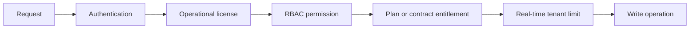

# Entitlements And Feature Gates

## Enforcement Order

Every protected write follows this order:

The ordering keeps identity and role authorization separate from commercial access. A contract override in `organization_entitlements` or `organization_limits` takes precedence over the plan default.

## Enforced Workflows

| Workflow | License | Entitlement | Limit |
| --- | --- | --- | --- |
| Facility creation | Yes | `facility.create` | `facilities` |
| Facility edit or delete | Yes | `facility.edit` / `facility.delete` | N/A |
| Activity and production records | Yes | Core workflow | N/A |
| Document upload | Yes | `documents.upload` | N/A |
| Report generation | Yes | `reports.generate` | `reports_month` |
| Projects, scenarios, opportunities | Yes | `projects.create` | N/A |
| ESG and OEM workflows | Yes | `compliance.manage` | N/A |
| Member invitations | Yes | Existing organization permission | `users` |
| Audit event access | Read-only | `security.audit_logs` | N/A |

`trial`, `active`, and non-read-only cancelled licenses can use the product. `suspended`, `expired`, and `read-only` licenses cannot make changes. Payment collection remains outside the application.

## Database Setup

Run migrations in this order for the Phase 4 system:

1. `009_entitlement_engine.sql`
2. `012_phase3_pricing_finalization.sql` when upgrading the original Phase 3 catalog
3. `013_phase4_feature_gate_enforcement.sql`

The final migration backfills licenses and current facility, user, and monthly-report usage for existing organisations.
