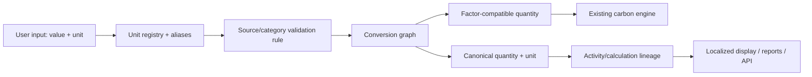

# Global Localization, Measurement, and Reference Data

Phase 7 introduces one database-backed platform for localization, measurement, and configurable master data. It is additive: existing records remain intact, while new activity and production records store the entered quantity/unit, canonical quantity/unit, conversion factor, and conversion path.

## Migration order

Run these in Supabase SQL Editor after the earlier migrations:

1. `server/migrations/011_reporting_compliance_foundation.sql` if it has not already been applied.
2. `server/migrations/015_phase6_reporting_runtime.sql` if it has not already been applied.
3. `server/migrations/016_global_reference_localization.sql`
4. `server/migrations/017_unit_registry_expansion.sql`

Migration 016 backfills `organization_localization`, display-unit preferences, and canonical provenance columns. It does not overwrite legacy quantities or carbon calculations.

Migration 017 adds therms, kcal, imperial gallons, US short tons, ounces, feet, yards, days, people/count, and PUE/percentage units. It is required for dropdowns covering every public-calculator input.

## Measurement flow

The existing carbon engine is deliberately unchanged. The new `measurementService` resolves an entered unit through `unit_registry`, validates it against `unit_validation_rules`, converts through the configured graph, and provides the factor-compatible quantity to the current calculation engine.

## Canonical conventions

| Category | Canonical unit |
| --- | --- |
| Energy/electricity | `kWh` |
| Volume/water | `m3` |
| Mass | `kg` |
| Distance | `km` |
| Carbon | `kgCO2e` |
| Production | `production-kg` |

Emission factors retain their activity unit. This lets their source methodology remain intact while new records also preserve a canonical quantity and conversion lineage.

## APIs

- `GET /api/localization`, `PUT /api/localization`, `PUT /api/localization/me`
- `GET /api/units`, `/api/units/categories`, `/api/units/defaults`, `/api/units/search`, `/api/units/:id`, `/api/units/conversions`
- `POST /api/units/convert`, `/api/units/display`, `/api/units`
- `PATCH|DELETE /api/units/:id`
- `GET /api/reference/categories`, `/api/reference/search`, `/api/reference/hierarchy`, `/api/reference/value/:id`, `/api/reference/:category`
- `POST /api/reference`, `PUT|DELETE /api/reference/:id`

Energy API records now include `inputQuantity`, `inputUnit`, `canonicalQuantity`, `canonicalUnit`, `conversionFactor`, `conversionPath`, `displayValue`, and `displayUnit` in addition to legacy fields.

## Administration and permissions

Reference-data permissions are database permissions seeded by migration 016: `reference.read`, `reference.create`, `reference.edit`, `reference.publish`, `reference.archive`, `reference.import`, and `reference.export`. Organisation administrators receive the complete set. Unit and reference changes invalidate the in-process registry cache; restarting an API instance also starts with a clean cache.

Custom units are created by `POST /api/units`. The unit must specify an active category, a canonical unit or an appropriate configured conversion rule, and supported metadata. New conversion rules are data, not application constants.

## Current boundary

This phase adds the central platform, organization settings, dynamic activity-unit selection, and provenance-aware APIs. Bulk CSV/Excel ingestion can use the same `POST /api/units/convert` and source validation service when an import job/worker is introduced; no separate conversion implementation should be written for imports.
