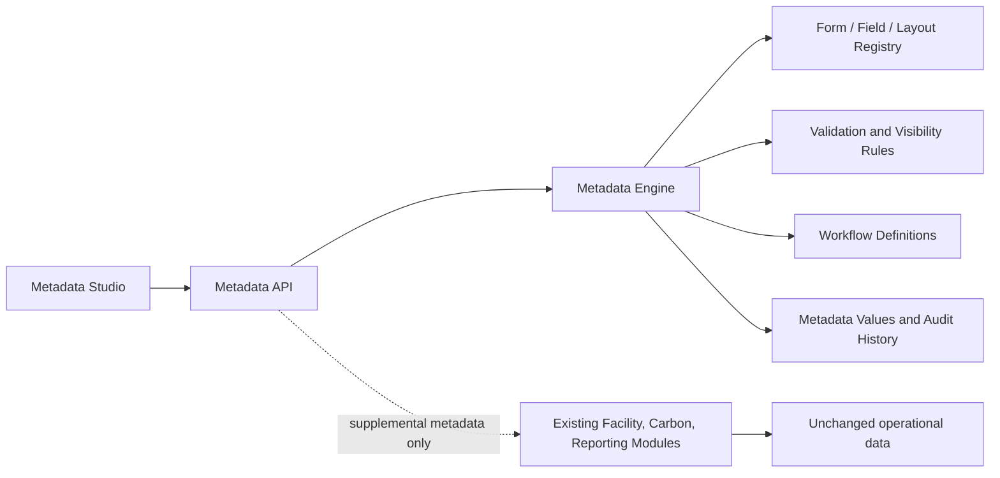

# Enterprise Metadata Platform

## Purpose

Phase 8 adds a tenant-safe, metadata-driven extension layer to Balancing Carbon. It allows an organisation to define supplemental fields, forms, layouts, rules, permissions, workflow states, templates, translations, and stored values without changing carbon-accounting, reporting, dashboard, or authentication code.

Existing forms remain the operational source of truth. Metadata forms are introduced alongside them and are intended for progressive migration of new customer-specific workflows.

## Deployment

Run [018_enterprise_metadata_platform.sql](../server/migrations/018_enterprise_metadata_platform.sql) in Supabase after migrations `000` through `017`, then restart the local server:

```powershell
npm run dev
```

The migration creates the metadata RBAC permissions. Existing organisation administrators receive them automatically. Sustainability managers receive read, value-entry, workflow, and export access.

## Architecture



### Core tables

`metadata_entities`, `metadata_field_types`, `metadata_fields`, `metadata_forms`, `metadata_form_sections`, `metadata_layouts`, `metadata_groups`, `metadata_templates`, `metadata_validations`, `metadata_conditions`, `metadata_visibility`, `metadata_permissions`, `metadata_workflows`, `metadata_states`, `metadata_transitions`, `metadata_versions`, `metadata_values`, `metadata_translations`, and `metadata_calculations` form the required registry.

`metadata_workflow_instances`, `metadata_workflow_history`, and `metadata_audit_logs` support live workflow execution and immutable audit history.

### Tenant model

- System entities and templates have `organisation_id = null` and are read-only in Metadata Studio.
- Organisation-owned forms, fields, layouts, templates, values, workflow instances, and audit entries are constrained by `organisation_id`.
- The API uses the existing authenticated authorization context and metadata-specific RBAC permissions.
- RLS is enabled on all metadata tables. Server routes use the existing service-role client only after authentication and tenancy authorization.

## APIs

| Endpoint | Purpose |
| --- | --- |
| `GET /api/metadata/entities` | Entity registry |
| `POST /api/metadata/entities` | Register a future entity without source changes |
| `GET /api/metadata/field-types` | Supported dynamic field types |
| `GET/POST /api/metadata/forms` | List and create forms |
| `GET/PUT/DELETE /api/metadata/forms/:id` | Load, version, or archive a tenant form |
| `POST /api/metadata/forms/:id/publish` | Publish a versioned form |
| `GET /api/metadata/layouts` | Layout definitions |
| `GET /api/metadata/templates` | Industry templates |
| `GET /api/metadata/render` | Renderable form definition and saved values |
| `POST /api/metadata/render/:entityKey/:recordId` | Validate and save values |
| `POST /api/metadata/validate` | Validate without saving |
| `POST /api/metadata/workflows/:id/transition` | Apply a permitted workflow transition |
| `GET /api/metadata/forms/:id/export` | Export JSON or CSV field definitions |
| `POST /api/metadata/import` | Import JSON form backups/templates or CSV field definitions |

## Rule model

Conditions use JSON rather than executable code. A condition supports `all`, `any`, `not`, `field`, `operator`, and `value`. Supported operators include `equals`, `not-equals`, `exists`, `in`, `contains`, and numeric comparisons. This prevents custom metadata from executing arbitrary server or browser code.

Validation rules support required, min/max, regex, uniqueness, cross-field checks, reference checks, conditional requirements, and custom-rule configurations. Formula metadata is declarative; it is deliberately separate from the audited carbon calculation engine.

## Administration workflow

1. Open **Metadata Studio** from the dashboard System navigation.
2. Select an entity from the registry.
3. Inspect the supplied system template or create a tenant form.
4. Add sections and fields, reorder sections by dragging, then save a draft.
5. Publish when the form has been reviewed. Each save creates an immutable snapshot.
6. Use the render endpoint or `DynamicMetadataForm` component to attach the form to a new or progressively migrated screen.

## Current boundaries

- The platform does not replace existing facility, activity, report, or calculation forms automatically.
- Carbon calculations remain implemented in the dedicated accounting engine and are not evaluated from metadata formulas.
- JSON is the full-fidelity import/export and backup format. CSV import/export supports field-definition interchange using `field_key,label,type,section_key,required` columns.
