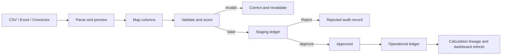

# Phase 7 - Enterprise Data Platform

## Status

Phase 7 is complete for file-based and platform-controlled ingestion. Live ERP and IoT adapters are connector-ready but remain disabled until a customer supplies credentials, endpoint contracts, and any required vendor licenses.

## Delivered capabilities

- CSV and `.xlsx` ingestion with a 5,000-row preview limit
- Source definitions for energy, production, water, waste, air emissions, and materials
- Automatic and editable column mapping
- Reusable saved mappings
- Required-field, date, number, unit, facility-reference, duplicate, and anomaly validation
- Row-level issues and confidence scoring
- Import queue, retry state, pipeline runs, and pipeline events
- Duplicate signatures scoped to each organisation
- Governed staging ledger with approve, reject, and post actions
- Version history for reviewed and posted staged records
- Operational posting to energy, production, water, waste, material, and air-emission ledgers
- Carbon calculation lineage, factor version, evidence reference, and facility aggregate refresh for energy records
- Automatic browser refresh after operational posting
- Connector catalog and organisation connection records without storing raw credentials

## Deployment

Apply migrations in order:

1. `019_enterprise_data_platform.sql`
2. `020_environmental_operational_ledgers.sql`
3. `021_energy_factor_registry_compatibility.sql`

Then install dependencies and restart:

```powershell
npm install
npm run dev
```

## Data lifecycle



## Security boundary

- Every job, staged record, connection, mapping, quality issue, and operational row is organisation-scoped.
- Import, connector, management, approval, and read actions use dedicated RBAC permissions.
- Raw passwords, API keys, and OAuth tokens are not stored by the current connector configuration API. Only a secret-manager reference may be saved.
- System connector entries marked `preview` are not live integrations.
- Duplicate imports are ignored through an organisation-level unique signature.

## API index

| Endpoint | Purpose |
| --- | --- |
| `GET /api/data-platform/connectors` | Connector catalog |
| `GET/POST /api/data-platform/connections` | Organisation connector configurations |
| `GET /api/data-platform/sources` | Supported source schemas |
| `GET/POST /api/data-platform/mappings` | Reusable mappings |
| `POST /api/data-platform/imports/preview` | Parse, map, validate, and persist preview rows |
| `GET /api/data-platform/jobs` | Import queue |
| `GET /api/data-platform/jobs/:id` | Rows, issues, and pipeline history |
| `POST /api/data-platform/jobs/:id/commit` | Add valid rows to staging |
| `POST /api/data-platform/jobs/:id/retry` | Requeue eligible imports |
| `GET /api/data-platform/staging` | Staging ledger |
| `POST /api/data-platform/staging/:id/review` | Approve a staged record |
| `POST /api/data-platform/staging/:id/reject` | Reject staged or approved records |
| `POST /api/data-platform/staging/:id/post` | Post an approved record |
| `GET /api/data-platform/operational/:ledger` | Water, waste, material, or air ledger |

## Remaining credential-dependent work

SAP, Oracle, Dynamics, Odoo, Zoho, QuickBooks, Tally, and smart-meter catalog entries require customer-specific API contracts. Implement each adapter only after confirming authentication, pagination, rate limits, source schemas, incremental-sync semantics, and commercial licensing.
