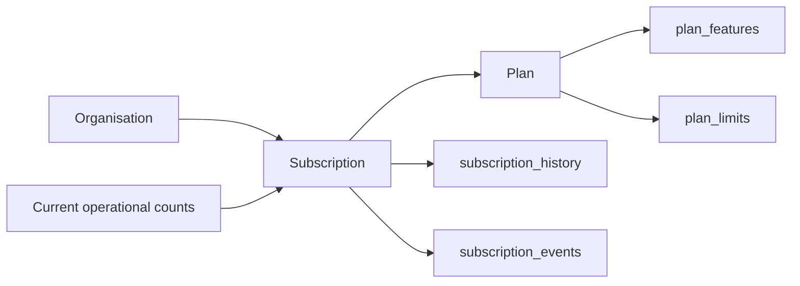

# Subscription And Pricing Architecture

## Flow

`007_subscription_pricing.sql` is database-driven and does not call a payment provider or enforce plan limits. It backfills every organisation with a live Starter subscription.

Run `008_plan_feature_inheritance.sql` after `007`. It makes Professional include Starter capabilities, Enterprise include Professional and Starter capabilities, and Enterprise+ include every lower-tier capability.

## Plan Data

Starter, Professional, and Enterprise each include one organisation. Enterprise+ uses a `custom` organisation limit, meaning capacity is negotiated per contract. Features and limits are read from `plan_features` and `plan_limits`; the frontend does not define a plan matrix.

## API

| Method | Path | Purpose |
| --- | --- | --- |
| GET | `/api/plans` | Public active plan catalog |
| GET | `/api/subscription` | Current organisation subscription |
| GET | `/api/subscription/usage` | Informational current usage |
| GET | `/api/subscription/features` | Current plan features and limits |
| POST | `/api/subscription/upgrade` | State-only plan change |
| POST | `/api/subscription/cancel` | State-only cancellation |
| POST | `/api/subscription/renew` | State-only renewal |

Subscription actions require the existing database permission `subscription.manage`. Every action is recorded in `subscription_history` and `subscription_events`.

## Future Billing Boundary

Future providers such as Stripe, Razorpay, Paddle, and LemonSqueezy should translate verified provider events into the existing subscription history/event model. Do not trust a browser callback to activate a subscription. Feature-gate enforcement begins only in Phase 4.
